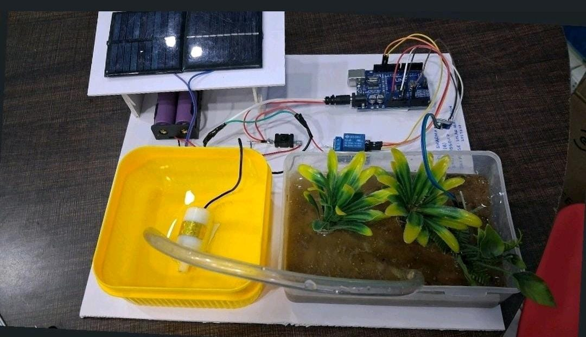

# 🌱 Automated Smart Irrigation System

An Arduino-based hardware project designed to automate the irrigation process and reduce manual effort in plant watering.

## 📌 Overview

This project was developed as an early hands-on hardware project to explore sensor integration, microcontroller programming, and automation.

The prototype demonstrates an irrigation setup where a microcontroller-based system controls the water supply to plants.

## 🎯 Objective

The objective of this project was to develop a basic automated irrigation prototype and understand the practical integration of:

- Microcontrollers
- Sensors
- Water pumps
- Hardware automation
- Electronic components

## ⚙️ System Architecture

Sensor/Input  
↓  
Microcontroller  
↓  
Decision Making  
↓  
Water Control System  
↓  
Plant Irrigation  

## 🔧 Hardware Prototype

The prototype consists of a plant irrigation setup with a water reservoir, water delivery mechanism, electronic control system, and associated hardware components.

## 🔧 Hardware Components

- Arduino Uno
- Soil Moisture Sensor
- Relay Module
- Water Pump
- 16×2 I2C LCD Display
- Water Reservoir and Tubing

## ⚙️ Working Principle

1. The soil moisture sensor reads the moisture level of the soil.
2. The Arduino processes the sensor reading.
3. The soil moisture value is displayed on the 16×2 I2C LCD.
4. The sensor reading is compared with a predefined threshold.
5. Based on the condition, the relay controls the water pump.
6. The system continuously monitors the soil at regular intervals.

## 🛠️ Skills Demonstrated

- Arduino Programming
- Embedded Systems
- Sensor Integration
- Hardware Prototyping
- Automation
- Electronic Circuit Integration

## 📸 Prototype

## 🚀 Learning Outcomes

This project provided hands-on experience in building and integrating a physical hardware prototype. It helped develop an understanding of how sensors, microcontrollers, and actuators can work together to automate a real-world process.

---

⭐ This project represents one of my early explorations into IoT and embedded hardware systems.
